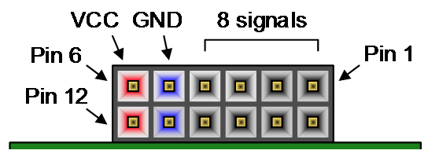
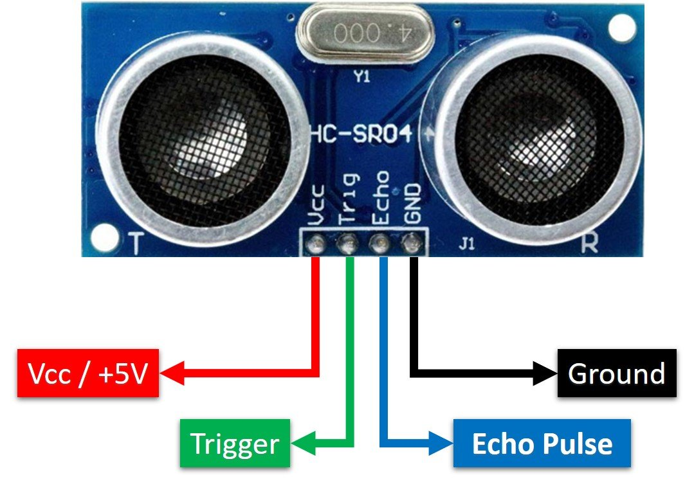
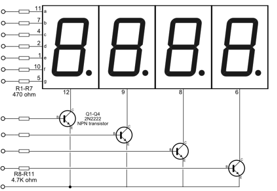
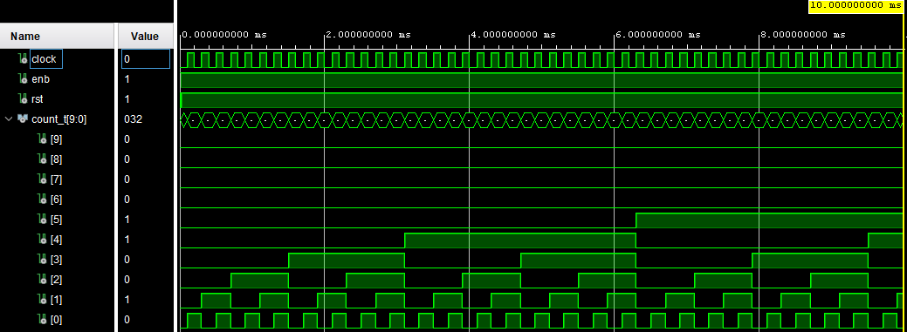
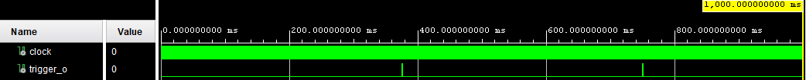
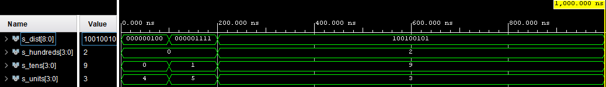
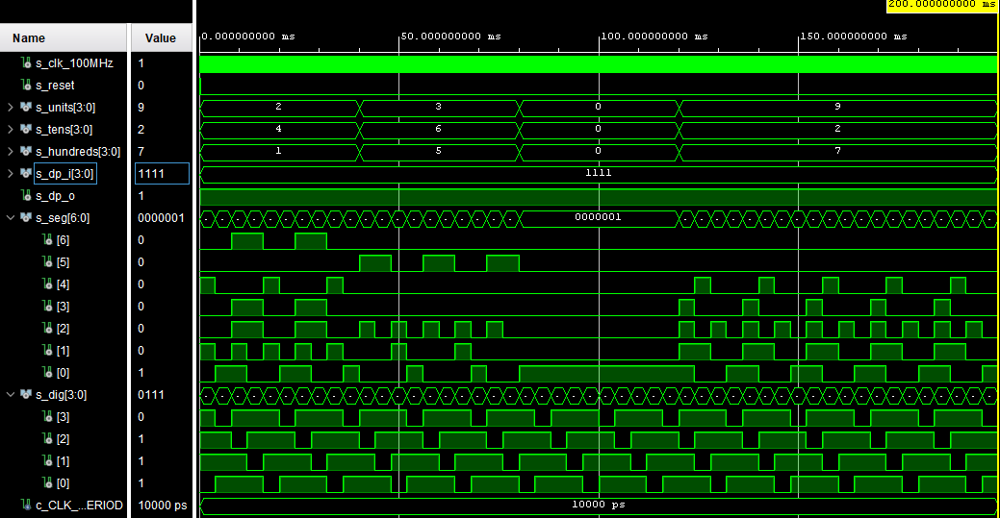
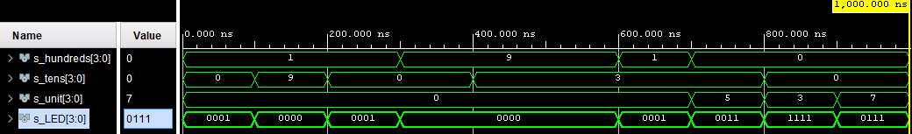
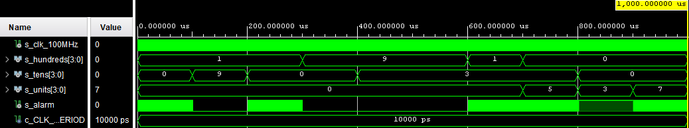
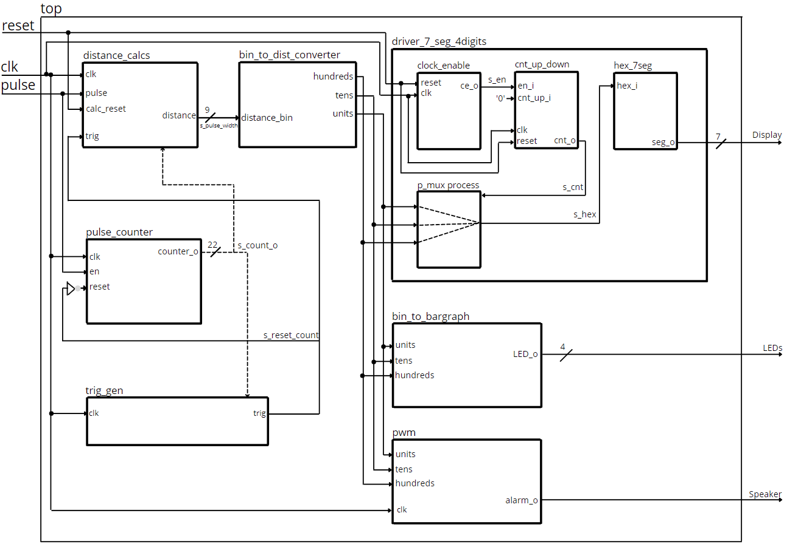

# Parking assistant with HC-SR04 ultrasonic sensor, sound signaling using PWM, signaling by LED bargraph

### Team members

* Mikhail Smolnikov
* Jakub Soboňa  
* Richard Stupka 
* Dušan Sýkora  
* Vladimíra Šebová 

[GitHub project folder](https://github.com/prostmich/Digital-Electronics-1-Project)

### Project objectives

The main goal of the project is to create a parking assistant program that will primarily use the HC-SR04 sensor to measure the distance from the objects. In cooperation with it, it will also use PWM sound signaling, the sound of which will be escalated by the approaching object. Last but not least, we will also use LEDs built into our used Arty A7-35T board. The improvement of our project is a 4 digit 7 segment display, which will display the distance from the object in centimeters.

## Hardware description
**Board:** Arty A7-35T
The Arty family of Digilent FPGA/SoC boards was designed with versatility and flexibility in mind. With universally popular Arduino™ headers and multiple Pmod™ ports, an Arty will be the most adaptable FPGA/SoC board in your toolbox.

The Arty A7 is a ready-to-use development platform designed around the Xilinx Artix-7 FPGA family. With the Artix-7 devices, the Arty A7 board provides the highest performance-per-watt fabric, transceiver line rates, DSP processing, and AMS integration in the Arty family. With the MicroBlaze Soft Processor Core from Xilinx, you can create embedded applications with a variety of peripherals, memory, and interfaces.

The Arty A7 is supported by Xilinx's Vivado Design Suite, including the free WebPACK version. You can also leverage the Vitis Core Development Kit or Xilinx Software Development Kit to start developing for the MicroBlaze processor with no prior FPGA experience.

There are two variants of the Arty A7: The Arty A7-35T features the XC7A35TICSG324-1L, and the Arty A7-100T features the larger XC7A100TCSG324-1.

| Callout | Description | Callout | Description | Callout | Description |
| :-: | :-: | :-: | :-: | :-: | :-: |
| 1 | FPGA programming DONE LED | 8 | User RGB LEDs | 15 | chipKIT processor reset |
| 2 | Shared USB JTAG/UART port | 9 | User slide switches | 16 | Pmod connectors |
| 3 | Ethernet connector | 10 | User push buttons | 17 | FPGA programming reset button |
| 4 | Mac address sticker | 11 | Arduino/chipKIT shield connectors | 18 | SPI flash memory |
| 5 | Power jack for optional external supply | 12 | Arduino/chipKIT shield SPI connectors | 19 | Artix FPGA |
| 6 | Power good LED | 13 | chipKIT processor reset jumper | 20 | Micron DDR3 memory |
| 7 | User LEDs | 14 | FPGA programming mode | 21 | Dialog Semiconductor DA9062 power supply |

**Pins from the board**

**Board connection table**

|  | Pmod JA | Pmod JB | Pmod JC | Pmod JD |
| :-: | :-: | :-: | :-: | :-: |
| Pmod Type | Standard | High-Speed | High-Speed | Standard |
| Pin 1 | G13 | E15 | U12 | D4 |
| Pin 2 | B11 | E16 | V12 | D3 |
| Pin 3 | A11 | D15 | V10 | F4 |
| Pin 4 | D12 | C15 | V11 | F3 |
| Pin 7 | D13 | J17 | U14 | E2 |
| Pin 8 | B18 | J18 | V14 | D2 |
| Pin 9 | A18 | K15 | T13 | H2 |
| Pin 10 | K16 | J15 | U13 | G2 |

**Sensor:** HC-SR04 ultrasonic sensor

**Sensor connection table**

| Sensor Pin | Board Pin |
| :-: | :-: | 
| VCC | VCC | 
| Trig | D4 | 
| Echo | G13 | 
| GND | GND | 

**Electric parameters of the sensor**

| Parameter | Value |
| :-: | :-: | 
| Working Voltage | DC 5V | 
| Working Current | 15mA | 
| Working Frequency | 40Hz | 
| Max Range | 4m | 
| Min Range | 2cm |
| Measuring Angle | 15 degree |
| Trigger Input Signal | 10uS TTL pulse |
| Echo Output Signal | Input TTL lever signal and the range proportion |
| Dimension | 45*20*15mm |

**Display:** 4 digit 7 segment display

**Display connection table**

| Display Pin | Board Pin (Anode) |
| :-: | :-: | 
| AN0 | E15 | 
| AN1 | E16 | 
| AN2 | D15 | 
| AN3 | C15 | 

| Display Pin | Board Pin (Cathode) |
| :-: | :-: | 
| CA | U12 | 
| CB | V12 | 
| CC | V10 | 
| CD | V11 | 
| CE | U14 | 
| CF | V14 | 
| CG | T13 |
| DP | T13 | 

## VHDL modules description and simulations

**Distance calculation**

Calculates distances based on received pulses from the HC-SR04 sensor.
The output is a 9-bit signal, representing the distance of the object from the sensor.

**Pulse counter**

Counts how many pulses were received. This number is used for further distance calculation.

**Simulated waveforms**

**Trigger generator**

Generates pulses that are used to determine when the distance will be calculated.
The pulse generation interval is set to 250ms.

**Simulated waveforms**

**Binary to distance converter**

Converts the binary signal from the "Distance Calculation" module to certain distance units.
The output value is divided into hundreds, tens, units of centimeters.

**Simulated waveforms**

**Seven segment display driver**

This module, added by us, is designed to convert the distance to a signal, which is sent to an external display.
We use only the last three digits, the first is always "0" because we do not need to show a distance value greater than 400 centimeters.

**Simulated waveforms**

**Binary to bargraph driver**

This module converts the calculated distance value to a certain number of lit LEDs.

Conditions for lighting of individual LED diodes are:
| Range | Number of LEDs |
| :-: | :-: | 
| 0cm — 5cm | 4 |
| 6cm — 9cm | 3 | 
| 10cm — 49cm | 2 | 
| 50cm — 249cm | 1 | 
| 250cm +  | 0 |

**Simulated waveforms**

**Pulse-width modulator**

This module generates a rectangular signal of a certain frequency. We change the delay of individual signal sections based on the distance of the object from the sensor.
The closer the object, the more frequent the alarm signals.

Conditions for sound signaling are:
| Range | Delay of signaling |
| :-: | :-: | 
| 0cm — 5cm | 0 sec |
| 6cm — 9cm | 1 sec | 
| 10cm — 49cm | 2 sec | 
| 50cm — 249cm | 3 sec | 
| 250cm +  | ∞ sec |

**Simulated waveforms**

## TOP module description and simulations

The main element of the system is the ultrasonic sensor HC-SR04, which calculates the time period on the basis of the sent and subsequently received waves. This time interval determines the distance of the object from the sensor. By processing the received data, we obtain the distance, which is divided into hundreds, tens and units of centimeters for additional signaling, both visual and audible. The visual signaling is shown on the display and LEDs. The sound signaling is realized by the speaker.

## Video

[Video presentation](https://www.youtube.com/watch?v=QQhM2zi_9Ok)

## Conclusion

Our assignment was to create a parking system using HC-SR04 sensors with sound PWM signaling and LED bargraph.
We met the goals of the project, we managed to create a functional parking system. We used instead of an external bargraph
already existing LEDs on the board. Our project could be further enriched, for example, by an external bargraph, sound signaling
with a different frequency or just more range of observation distance.

## References

   * [Arty A7 Reference Manual](https://reference.digilentinc.com/reference/programmable-logic/arty-a7/reference-manual)
   * [Arty A7 Schematic Prints](https://reference.digilentinc.com/_media/reference/programmable-logic/arty-a7/arty_a7_sch.pdf)
   * [Ultrasonic Ranging Module HC-SR04 Datasheet](https://cdn.sparkfun.com/datasheets/Sensors/Proximity/HCSR04.pdf)
   * [HC-SR04 Ultrasonic Sensor Tutorial](https://lastminuteengineers.com/arduino-sr04-ultrasonic-sensor-tutorial)
   * [Double dabble](https://en.wikipedia.org/wiki/Double_dabble)
