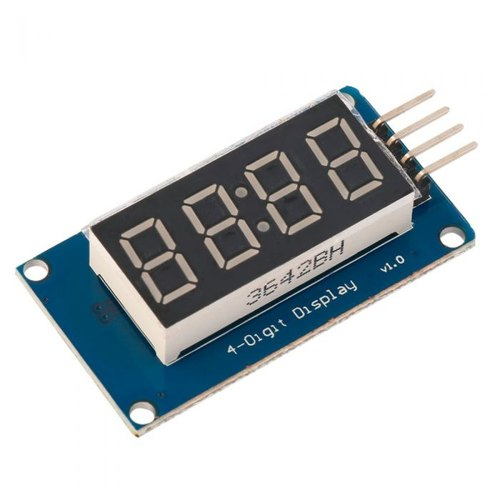

# Parking assistant with HC-SR04 ultrasonic sensor, sound signaling using PWM, signaling by LED bargraph

### Team members

* Mikhail Smolnikov
* Jakub Soboňa  
* Richard Stupka 
* Dušan Sýkora  
* Vladimíra Šebová 

[GitHub project folder](https://github.com/prostmich/Digital-Electronics-1-Project)

### Project objectives

The main goal of the project is to create a parking assistant program that will primarily use the HC-SR04 sensor to measure the distance from the objects. In cooperation with it, it will also use PWM sound signaling, the sound of which will be escalated by the approaching object. Last but not least, we will also use LEDs built into our used Arty A7-35T board. The improvement of our project is a 4 digit 7 segment display, which will display the distance from the object in centimeters.

## Hardware description
**Board:** Arty A7-35T

| Callout | Description | Callout | Description | Callout | Description |
| :-: | :-: | :-: | :-: | :-: | :-: |
| 1 | FPGA programming DONE LED | 8 | User RGB LEDs | 15 | chipKIT processor reset |
| 2 | Shared USB JTAG/UART port | 9 | User slide switches | 16 | Pmod connectors |
| 3 | Ethernet connector | 10 | User push buttons | 17 | FPGA programming reset button |
| 4 | Mac address sticker | 11 | Arduino/chipKIT shield connectors | 18 | SPI flash memory |
| 5 | Power jack for optional external supply | 12 | Arduino/chipKIT shield SPI connectors | 19 | Artix FPGA |
| 6 | Power good LED | 13 | chipKIT processor reset jumper | 20 | Micron DDR3 memory |
| 7 | User LEDs | 14 | FPGA programming mode | 21 | Dialog Semiconductor DA9062 power supply |

**Board connection table**

|  | Pmod JA | Pmod JB | Pmod JC | Pmod JD |
| :-: | :-: | :-: | :-: | :-: |
| Pmod Type | Standard | High-Speed | High-Speed | Standard |
| Pin 1 | G13 | E15 | U12 | D4 |
| Pin 2 | B11 | E16 | V12 | D3 |
| Pin 3 | A11 | D15 | V10 | F4 |
| Pin 4 | D12 | C15 | V11 | F3 |
| Pin 7 | D13 | J17 | U14 | E2 |
| Pin 8 | B18 | J18 | V14 | D2 |
| Pin 9 | A18 | K15 | T13 | H2 |
| Pin 10 | K16 | J15 | U13 | G2 |

**Sensor:** HC-SR04 ultrasonic sensor

**Sensor connection table**

| Sensor Pin | Board Pin |
| :-: | :-: | 
| VCC | VCC | 
| Trig | G13 | 
| Echo | D13 | 
| GND | GND | 

**Display:** 4 digit and 7 segment display

**Display connection table**(doplniť)

| Display Pin | Board Pin |
| :-: | :-: | 
| ? | ? | 

## VHDL modules description and simulations

Write your text here.

## TOP module description and simulations

Write your text here.

## Video

*Write your text here*

## References

   1. Write your text here.
